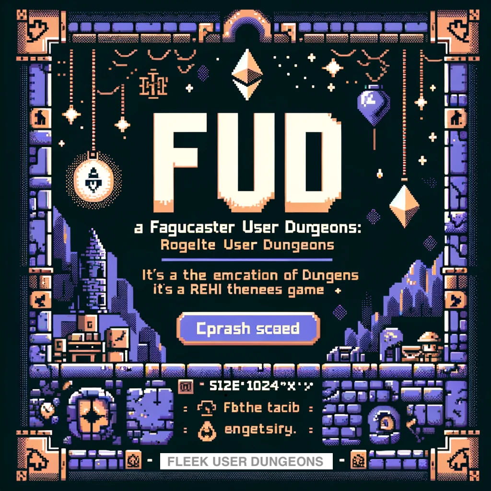

<a href="https://warpcast.com/an0n/0x3748eeea"></a>

# Fleek User Dungeon (FUD)

Welcome to **Fleek User Dungeon (FUD)**, a simple Multi-User Dungeon (MUD) playable within Farcaster using Fleek functions. This project leverages ROT.js for game mechanics and includes a custom SVG render engine due to ROT.js's lack of built-in SVG support.

## Features

- **Fully Functional MUD**: Enjoy a classic text-based adventure game.
- **Custom SVG Renderer**: Unique rendering engine tailored for SVG, ensuring smooth visuals.
- **SVG Conversion to png**: Convert SVG to PNG for Farcaster compatibility, all inside fleek using WASM.
- **Compression for Farcaster Compatibility**: State compression using manual and gzip methods to fit within Farcaster's 2000 character limit.

## TODO

- **More Actions**: Given the limited buttons in Farcaster, the player can only move in 4 directions, but would be great to add more actions base on player position, example if he is in a stair, he can go up or down. If he is standing in a potion he can drink it.
- **Items and Inventory**: Add items to the game, and allow the player to pick them up and use them.
- **Claim Rewards**: Add a way to claim rewards (or just mint an NFT) when the player reaches a certain point in the game.
- **Leaderboard**: Add a leaderboard to track the best players.
- **Better compression**: The current compression method is very basic, it would be great to implement a more efficient way to compress the game state. Like taken advantage of the fact that the game is generated procedurally and we can use that *seed* to compress the state.

## Getting Started

### Prerequisites

- Node.js
- npm (Node Package Manager)
- Fleek CLI
- ngrok

### Installation

1. **Clone the repository**
    ```bash
    git clone https://github.com/yourusername/fleek-user-dungeon.git
    cd fleek-user-dungeon
    ```

2. **Install dependencies**
    ```bash
    npm install
    ```


3. **Build with rollup**
    ```bash
    npm run build
    ```

4. **Deploy the Fleek function**
    ```bash
    fleek functions deploy --name fudGame --path fleek.js
    ```

5. **Local testing**
    ```bash
    npm run dev
    ```

6. **Connect with ngrok and the Farcaster debugger**
    - Start ngrok
    ```bash
    ngrok http 3000
    ```
    - Use the generated ngrok URL with the Farcaster debugger: [Farcaster Frame Debugger](https://warpcast.com/~/developers/frames)

7. Alternative you can use Frames to test the game, just run the express server and [FramesJS](https://framesjs.org/) will take care of the rest.


### Playing the Game

You can access the game using the following link:
[Fleek User Dungeon](https://warpcast.com/an0n/0x3748eeea)

## Technical Details

- **Game Mechanics**: Built using [ROT.js](https://ondras.github.io/rot.js/hp/), a JavaScript library for roguelike games.
- **Rendering**: Custom SVG engine for rendering game visuals.
- **State Management**: State is manually compressed and then gzip compressed to fit within the Farcaster's constraints.
  
## Contributing

We welcome contributions! Please follow these steps:

1. Fork the repository
2. Create your feature branch
    ```bash
    git checkout -b feature/YourFeature
    ```
3. Commit your changes
    ```bash
    git commit -m 'Add some feature'
    ```
4. Push to the branch
    ```bash
    git push origin feature/YourFeature
    ```
5. Open a pull request

## License

This project is licensed under the MIT License.

## Contact

If you have any questions, feel free to open an issue or reach out to the project maintainer @eugenioclrc and @rotcivegaf.

---

Enjoy your adventure in Fleek User Dungeon!